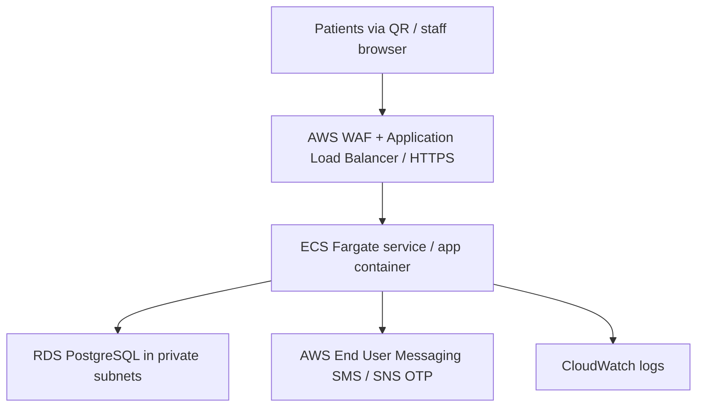

# Velavan Hospital App

Responsive patient and hospital-desk application backed by PostgreSQL. The QR code should point to the eventual HTTPS address, for example `https://appointments.hospital.example/`. The app has no on-site server requirement.

## Included workflows

- Public doctor list and live availability; daily, selected weekdays, or a day of the month, with hours, slot length, capacity, and unavailable dates.
- Mobile OTP verification, family profiles sharing a number but each with a permanent UHID, duplicate registration warning, booking, move, and cancellation.
- Separate staff sign-in. Reception can search and register patients, confirm identity and book; admin can additionally register patients without a mobile number, manage doctors, mark leave, and import UHIDs from CSV.
- Affected bookings remain in the database when a doctor's schedule changes. Staff see those needing rescheduling.
- No reminder workflow in v1, consistent with the attached approved requirements. SMS is used only for OTP in production.

## Local setup

Requires Node.js 24+, npm, and PostgreSQL 16+ (Docker Compose file included where Docker is available).

1. `npm ci`
2. Start PostgreSQL with `docker compose up -d db`, or point `DATABASE_URL` to an existing PostgreSQL instance.
3. Copy `.env.example` to `.env`. Set `DATABASE_URL` and a random `SESSION_SECRET` of at least 32 characters. Keep `SMS_PROVIDER=console` for **local development only**; codes appear in the API terminal.
4. `npm run dev` automatically migrates the schema and seeds the initial administrator and sample data before starting the app. A fresh local database creates the administrator with username `admin` and password `admin`; the database ID is generated automatically. Sign in through **Hospital desk**. The seed is idempotent: rerunning it does not reset an existing password. If you used the previous release, its `velavan.admin` account is retained and the new `admin` account is added.
5. Visit `http://localhost:5173`. The three sample doctors demonstrate daily, Tuesday-only, and 15th-of-the-month schedules. Four sample patients share two mobile numbers (`9000000001`, `9000000002`), one sample patient has no mobile number, and there are three sample appointments. With `SMS_PROVIDER=console`, the local OTP appears in the API terminal. Create a reception account when needed with `STAFF_PASSWORD='<strong password>' npm run staff:create -- reception 'Reception User' reception`.

`npm run build` compiles the browser and API, and `npm test` checks date and slot rules. In production, set `SEED_ADMIN_PASSWORD` (at least 12 characters) through a secret store and run `npm run db:setup:prod` as a **one-off job** before launching `npm start`. Production setup creates the `admin` username with that password and skips sample records by default. Set `SEED_DEMO_DATA=true` only in a nonclinical demo environment. The setup is idempotent: it preserves edited records and an existing administrator password. The local `admin` / `admin` credentials must not be used for patient data or a public deployment.

## CSV import

Admin → Import UHIDs. Provide a UTF-8 CSV with the headings `uhid,full_name,dob,age_years,sex,village,mobile`. Supply either `dob` (`YYYY-MM-DD`) or `age_years`; mobile can be blank. Preview before commit. Each import accepts up to 5,000 rows. Existing UHIDs and repeated UHIDs in the upload are rejected. Treat an imported UHID as the permanent identifier; the migration sequence starts with `RH-010001`, so adjust `uhid_seq` before issuing new UHIDs if imported records use the same format/range.

## AWS deployment reference

1. Build the supplied `Dockerfile`, push its image to ECR, and run a one-off `npm run db:setup:prod` task using that image. Run the API as an ECS Fargate service behind an HTTPS ALB; the container serves both the compiled UI and `/api` on port 3001.
2. Place RDS PostgreSQL in private subnets, permit port 5432 from only the ECS security group, enable encryption, automated backups, and point `DATABASE_URL` at it. Set `DATABASE_SSL=true` and configure the trusted RDS root certificate in the container for your region before using a TLS database connection.
3. Store `DATABASE_URL`, `SESSION_SECRET` and staff bootstrap secrets in AWS Secrets Manager; provide them to one-off tasks / ECS at runtime. Set `PUBLIC_ORIGIN` to the exact HTTPS app origin, `SMS_PROVIDER=aws`, and `AWS_REGION=ap-south-1` (or the chosen region). Give the ECS task role only the SMS publish permission it needs. The SMS sender ID and message template require India's DLT registration when using a local route.
4. Attach WAF rate controls to the ALB, restrict public ingress to HTTPS, and route `/api/health` for health checks. Set logs/metrics and alarms for API errors and database capacity. Size the task and RDS instance for expected load. The admin interface exposes the final patient QR code after `PUBLIC_ORIGIN` is set; print that code at reception.

This repository provides an AWS-ready container and deployment reference; **it does not create AWS resources or a live domain**. Actual deployment needs an AWS account, DNS name, TLS certificate, database, SMS registration and credentials.

## Operational notes

- The patient cookie is HTTP-only and expires after one hour; staff sessions expire after eight hours. Staff roles are enforced on the API. The public doctor directory has no patient data.
- A verified mobile number can manage linked family records as approved in the requirements. Staff must confirm identity to link or replace the number on an existing UHID. Do not include diagnosis or other sensitive clinical details in OTP texts.
- SMS must be configured before production patient sign-in. `SMS_PROVIDER=console` is rejected in production.
- Patient and staff journeys offer English and Tamil interface copy. Validate the Tamil wording and accessibility with hospital users before production launch; browser-supplied dates and some operational errors may follow the device language.
- Before handling real patient records, complete your organization's privacy, retention, audit, accessibility, threat-model and recovery review. In particular, add an immutable staff-action audit trail, distributed rate limiting for logins, and account recovery controls before production use.
